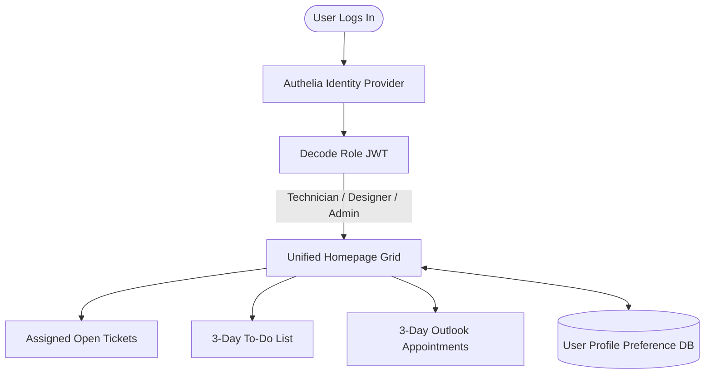
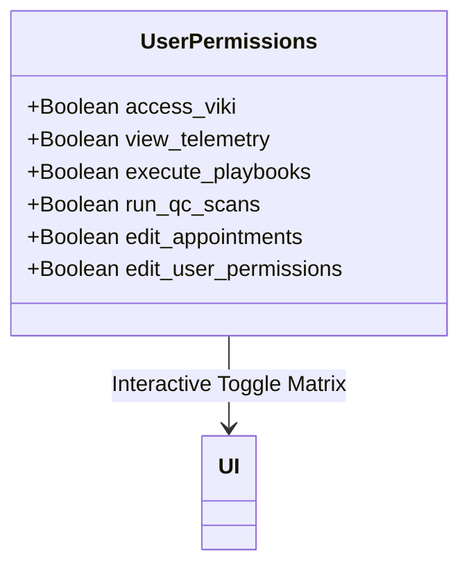
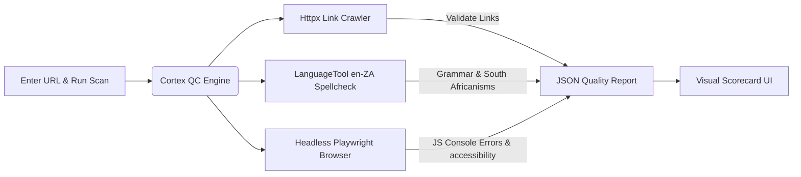
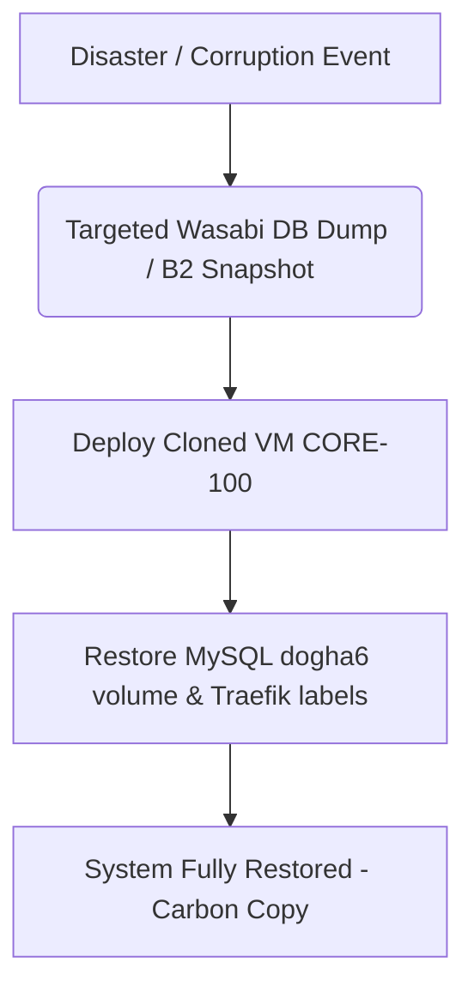
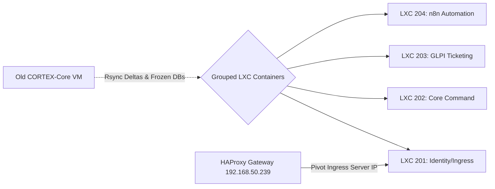

# CORTEX: USER ROADMAP & ARCHITECTURAL BLUEPRINT
## [VERSION 1.5] - STRUCTURAL EXPANSION SPECIFICATION

This document outlines the finalized architectural specification for the core user experience, permission management interfaces, web design quality assurance, calendar synchronization, integrated overtime systems, and security/infrastructure recovery safeguards for the CORTEX platform.

---

## 1. IDENTITY & MULTI-USER ROLE-BASED DASHBOARDS
### Architectural Specification: **STABLE & VERIFIED**

CORTEX will employ a multi-tenant portal with dynamically populated dashboards. All user groups share a unified dashboard grid engine, but retrieve personalized, context-filtered operational telemetry.

### Architectural Design
*   **Authentication & Directory Mapping:**
    *   **Authelia** maps users to specific organizational groups defined in **LLDAP** (e.g., `Cortex-Admins`, `Cortex-Designers`, `Cortex-Technicians`).
    *   Signed JSON Web Tokens (JWT) capture the user's identity, role, and department scope.
*   **Core Unified Widgets (Default Layout):**
    *   **Assigned Open Tickets Widget:** Displays the logged-in user's active, unresolved helpdesk tickets pulled from the GLPI database, including a brief description, current severity, and submission timestamp.
    *   **3-Day To-Do List Widget:** An interactive task tracker displaying items due within the upcoming 72 hours, synced dynamically with GLPI action plans or custom user-defined flags.
    *   **3-Day Outlook Appointments Widget:** Shows calendar events scheduled for the next 3 days, queried directly from MS 365.
*   **Aesthetics & State Persistence:**
    *   Fully customizable layout built using a responsive glassmorphic CSS Grid.
    *   Users can resize or drag-and-drop cards. Dashboard layout configurations are persisted in real-time to the database under `user_dashboard_preferences`.

---

## 2. GRANULAR PERMISSIONS & VIKI ASSIGNMENT PANEL
### Architectural Specification: **EXTENSIVE ACCESS CONTROL (RBAC) UI**

CORTEX will implement a highly visual, glassmorphic **Security & Access Console** accessible strictly to users with Administrative privileges (`Cortex-Admins`). This page features a clean, interactive matrix to toggle explicit permissions per user or department.

### Functional Design
*   **Interactive Toggles (Tick / Untick):**
    *   An admin console featuring a list of users/roles alongside a comprehensive grid of permission switches.
    *   Permissions are grouped logically:
        *   *General:* View Telemetry HUD, Edit Own Dashboard Widgets.
        *   *Operations:* Resolve Tickets, Edit Calendar Appointments, Access GoHighLevel CRM.
        *   *Sovereign / Security:* Trigger Isolation Playbooks, Run Web Staging QC Scans.
        *   *Administration:* Manage Directory Roles, Access System Configurations.
    *   Toggling a switch fires a background POST request to the API, immediately updating the user's scope settings and forcing a dynamic state refresh on the client dashboard.
*   **VIKI AI Assignment (Assign / Unassign):**
    *   A prominent, dedicated toggle to **"Assign VIKI"** to a user or department.
    *   **If Assigned:** The user gets access to the floating 3D holographic head matrix, active voice synthesis (TTS), local audio transcriber fallback (`/api/transcribe`), and the fullscreen glassmorphic conversation workspace (`/?mode=viki-chat`).
    *   **If Unassigned:** All VIKI-related visual elements, assets, Speech-to-Text hooks, and chat sidebars are completely stripped from their view to preserve resources and protect data leakage.

---

## 3. AUTOMATED WEB QUALITY CONTROL (QC) SCANNER
### Architectural Specification: **ON-DEMAND AUDITING MICROSERVICE**

A dedicated QC Scanner will live inside the developer/designer tools panel, allowing teams to manually initiate comprehensive pre-live checks on any designated staging or production URL.

### Technical Blueprint
*   **On-Demand Execution:** Web designers enter the URL in a dedicated input console widget and click **"Run Quality Scan"**. The UI displays a live progress status (Crawling, Auditing, Compiling) during execution.
*   **Broken Link Detection:** A fast asynchronous Python-based link checker processes the target page's DOM, identifies all anchors (`<a>`) and source links (`img`, `script`), and verifies HTTP status codes to detect broken or redirected targets.
*   **South African English (en-ZA) Integration:**
    *   Employs a custom spelling and grammar service driven by a local **LanguageTool** container.
    *   Pre-configured with specific South African English linguistic overrides (supporting British-derived spellings like *minimise*, *programme*, *colour* while respecting regional terms like *braai*, *robot*, and *rand*).
*   **Performance, SEO, & Accessibility Checks (Lighthouse Integration):**
    *   The scanner is expanded to run a native **Lighthouse CLI** audit headlessly via chromium.
    *   This evaluates Core Web Vitals (First Contentful Paint, Speed Index, Cumulative Layout Shift) and yields explicit performance metrics.
    *   SEO crawlers identify meta description tags, heading structures, and indexing indicators.
    *   Returns complete visual scorecards (Performance, Accessibility, SEO, Best Practices) directly on the designer widget.

---

## 4. MS 365 / OUTLOOK CALENDAR INTEGRATION
### Architectural Specification: **MICROSOFT GRAPH API INTEGRATION (SINGLE SOURCE OF TRUTH)**

Microsoft 365 functions as the absolute Single Source of Truth (SSoT) for all scheduling and calendars. CORTEX implements bidirectional synchronization to prevent scheduling conflicts.

```mermaid
sequenceDiagram
    participant CRM as GoHighLevel CRM
    participant Cortex as Cortex Middleware
    participant Graph as MS 365 Graph API
    
    rect rgb(30, 40, 50)
    Note over CRM, Graph: Dynamic Conflict Avoidance
    CRM->>Cortex: Trigger: Request Appointment Slot
    Cortex->>Graph: Query calendarView (Next 3 Days)
    Graph-->>Cortex: Return Busy/Free Windows
    alt Slot is Available
        Cortex->>Graph: Create Outlook Calendar Event (POST /events)
        Graph-->>Cortex: Confirm Created
        Cortex->>CRM: Commit CRM Appointment
    else Slot Clashes
        Cortex->>CRM: Terminate CRM Booking (Return Clash Warning)
    end
    end
```

### Technical Blueprint
*   **Microsoft Graph API Connection:**
    *   Register a dedicated Azure AD App registration inside the organization’s MS 365 tenant.
    *   Utilize secure OAuth 2.0 client credential flows using app-level or delegated permissions (`Calendars.ReadWrite`).
*   **Double-Booking Mitigation Engine:**
    *   When an appointment is requested (via GoHighLevel CRM) or a technician dispatch is proposed, the backend executes an automatic check against the recipient's MS 365 calendar using `GET /users/{id}/calendar/calendarView` for the targeted date/time window.
    *   If a clash exists, booking is denied, and the operator is presented with alternative free slots.
*   **Dynamic Dashboard Synced View:**
    *   The **3-Day Appointments Widget** uses direct Graph API queries to show real-time calendar cards, styled dynamically with glassmorphic cards (Meetings, Private Blocks, and Client Sessions).

---

## 5. STRATEGIC ARCHITECTURAL CONSIDERATIONS (ADDITIONS)

To ensure maximum operational stability, resilience, and security as CORTEX scales, the following secondary systems have been built into the roadmap:

### A. Immutable Permission Auditing (Forensic Logging)
*   **Concept:** Any modification to user permissions, role mappings, or VIKI assignment states must be treated as a security-critical event.
*   **Implementation:** The FastAPI permissions backend writes a structured, signed log entry directly to the **Forensic Data Lake BTRFS storage engine** (`/mnt/data_lake/audit/`). These logs are immutable, chronological, and can be reviewed during security compliance audits (e.g. NIST 2.0, ISO 27001).

### B. Offline Resiliency & PWA Capabilities
*   **Concept:** Helpdesk operators and field technicians must maintain access to critical ticket records and schedules even if MS 365 API endpoints rate-limit or experience temporary service disruption.
*   **Implementation:** Implement a client-side Service Worker caching layer (using IndexedDB or browser LocalStorage). If the Graph API or GLPI endpoints are unreachable, widgets fallback to the last-known state and render a subtle "Cached / Desynced" visual banner until the connectivity loop restabilizes.

### C. API Secret Vaulting
*   **Concept:** Storing MS 365 Client Secrets, GoHighLevel API keys, and database passwords in plain-text configuration files poses a risk of lateral movement if a staging container is compromised.
*   **Implementation:** Secure all core credentials inside our **NetLock stack** using encrypted environment variables or a containerized secret store (e.g., vault/sops), injected dynamically at runtime.

---

## 6. FUTURE IMPLEMENTATION: INTEGRATED OVERTIME & TIME-TRACKING SYSTEM (GLPI SYNC)
### Architectural Specification: **NATIVE ABSORPTION & UNIFIED FLOW**

To replace fragmented legacy microservices (such as the standalone `.NET Core` and `Next.js` OvertimeSystem app found in `/other_apps/OvertimeSystem/`), CORTEX will natively absorb overtime tracking directly into its existing stack.

```mermaid
sequenceDiagram
    participant User as Staff Member
    participant UI as CORTEX React Widget
    participant Fast as FastAPI Backend
    participant GLPI as GLPI Ticketing Engine
    participant Adm as Admin Approval Console
    
    rect rgb(35, 45, 55)
    User->>UI: Selects Active Ticket & Enters Overtime Hours
    UI->>Fast: POST /api/overtime/log (Hours + Deliverable)
    Fast->>GLPI: Add ITILFollowup Comment [PENDING APPROVAL]
    Fast->>Adm: Populate Admin Approval Queue
    
    Adm->>Fast: Action: Approve Overtime Request
    Fast->>GLPI: Add ITILFollowup Comment [APPROVED]
    Fast->>Fast: Commit to Permanent Ledger
    end
```

### Technical Design
*   **Unified Tech Stack Absorption:**
    *   Instead of maintaining a separate Postgres database, Docker containers, and a C# .NET API, all logic will be migrated into the **CORTEX FastAPI core** and **React dashboard**. This eliminates container sprawl, reduces server overhead on `CORTEX-Core`, and enforces a single login flow.
*   **Staff Logging Flow:**
    *   **The Overtime Widget:** Styled as a clean glassmorphic card on the homepage, it detects the logged-in user's assigned active tickets (pulled directly from GLPI via current user scope).
    *   **Time Entry:** Users enter the hours claimed and a brief summary of the specific deliverable completed.
    *   **Log Event:** Clicking "Submit" writes a stateful record (`Status: Pending`, `Timestamp`, `Hours`, `Deliverable`) to the central database, and uses our existing GLPI SQL/API integrations to immediately append an `ITILFollowup` ticket comment notifying managers of a pending claim.
*   **Manager Approval Interface:**
    *   Inside the administrative panel (`Cortex-Admins`), managers are presented with an interactive, scrollable approval queue showing all submitted overtime entries.
    *   Managers can click **"Approve"** or **"Reject"** with custom notes.
    *   Approval updates the local ledger status to `Approved` or `Rejected` and posts a final public follow-up comment directly to the original GLPI ticket (e.g. `[OVERTIME APPROVED] 2.5 hours verified by Admin`), closing the verification loop.

---

## 7. SECURITY AUDITING, DATA RECOVERY, & INTEGRITY PROTOCOLS (MANAGEMENT Q&A)
### Architectural Specification: **INFRASTRUCTURE INTEGRITY & FAIL-SAFES**

The following operational protocols address core security, disaster recovery, and diagnostic testing questions raised by the management and compliance teams.

### A. RMM Disaster Recovery & Carbon-Copy Restoration
*   **Question:** *Do we have a backup system in case RMM goes down or goes corrupt... does the system keep a database backup so restoring/cloning yields an up-to-date carbon copy?*
*   **Protocol:**
    *   **Automated Backup Stack:** All configuration, keys, and operational state mapping inside the NetLock RMM suite (database `dogha6` in the MySQL container) are fully targeted by automated backup schedules.
    *   **Unified Backup Pipeline:** The backup layer leverages **Bareos** (backing up directly to an offsite S3-compatible Wasabi storage) and **Restic** (targeting Backblaze B2).
    *   **Filesystem Snapshots (BTRFS):** Telemetry pipelines and logs are mirrored inside `/mnt/data_lake` which utilizes a **BTRFS filesystem** on VM LAKE-102. This enables point-in-time, read-only snapshots entirely immune to ransomware or DB corruption.
    *   **Carbon-Copy Restoration:** In the event of catastrophic server failure, importing the latest Restic database dump and re-linking the persistent Docker volumes into a freshly cloned server template brings the entire NetLock RMM ecosystem back online seamlessly, with zero agent re-registration required.

### B. Global API Kill Switch
*   **Question:** *Do we need a kill switch for all the active API connections?*
*   **Protocol:**
    *   **Operational Rationale:** **Yes.** With extensive external endpoints linking GoHighLevel CRM, Microsoft Graph, and GLPI, a central isolation valve is a critical defense-in-depth asset to stop data exfiltration during threat states.
    *   **Implementation:** We establish a master **"Emergency API Kill Switch"** button in the Admin Console.
    *   **Middleware Guard:** Activating the kill switch locks a flag in Redis (`api_kill_switch_active: true`). All outbound API request routines pass through a custom HTTP middleware. If active, all requests to external SaaS networks are instantly blocked at the transport layer, returning `503 Service Unavailable` locally.
    *   **Autonomous Triggering:** The **Reflex Daemon** is wired to autonomously trigger this kill switch if active host-level lateral threat indicators (e.g., Mimikatz, system tampering) are captured by our Vector/Velociraptor sensors.

### C. White-Box & Black-Box Diagnostic Integrity Testing
*   **Question:** *Have we done white and black-box testing to ensure the environment is secure?*
*   **Protocol:**
    *   **White-Box Testing (Structural Quality Verification):**
        *   *Static Code Auditing:* Surgically removed all loose typing declarations in React (replacing `: any` with structural interfaces) and enforced strict Python type-hinting in core services (`viki_agent`, `hermes_agent`, `cortex_reporter`).
        *   *SQL Injection Auditing:* Evaluated SQL querying parameters for database sync tasks. Verified that VIKI’s ReAct SQL discovery self-corrects using structured database introspection (`SHOW TABLES`) rather than unchecked raw command strings.
    *   **Black-Box Testing (Threat & Routing Ingress Verification):**
        *   *Active Threat Simulation:* Ran mock lateral movements and credential dumping via `simulate_breach.sh`. The **Reflex Daemon** successfully caught, blocked, and visually broadcasted WebSocket mitigation alerts.
        *   *Network Ingress Auditing:* Audited external HAProxy and Traefik routers, decommissioning redundant open routing ports and separating internal auth loops (e.g. Authelia wrapping) from native service auth endpoints to prevent credential routing circles.

---

## 8. DECENTRALIZED LXC CONTAINER TRANSITION PLAN
### Architectural Specification: **PARALLEL PROXMOX LXC MIGRATION & BLUE-GREEN SWITCHOVER**

To eliminate VM-level single points of failure (SPOF) and achieve true application modularity, CORTEX will transition from the consolidated single virtual machine (`CORTEX-Core`, VM 100) to domain-partitioned LXC containers.

### Functional Design & Switchover Playbook
*   **Parallel Deployment Strategy:** 
    *   Provision 4 lightweight Proxmox LXC containers (`192.168.50.251` through `192.168.50.254`) on the hypervisor host (`192.168.50.240`).
    *   LXC containers share the Proxmox host kernel (offering native performance and near-zero memory footprint) but provide separate user spaces and interfaces.
    *   Mount the data lake NFS share (`/mnt/data_lake`) natively across the containers.
*   **Blue-Green Maintenance Window:**
    *   **Freeze state:** Stop all Docker containers on the old VM 100 to freeze database writes.
    *   **Rsync sync:** Run a final delta sync of database and config volumes from VM 100 to the target LXCs.
    *   **Pivot Routing:** Update backend definitions in the HAProxy gateway (`192.168.50.239`) to point to the new Ingress LXC (`192.168.50.251`) and reload HAProxy.
*   **Fail-Safe Rollback Protocol:**
    *   If any issues occur, we revert the HAProxy backend mapping back to `192.168.50.241` and spin VM 100 containers back up.
    *   This restores service to the baseline `LOCH` tag state in under **10 seconds**.

---

*Document Finalized: Wednesday, 03 June 2026*
*Author: Antigravity Architect Mode*
