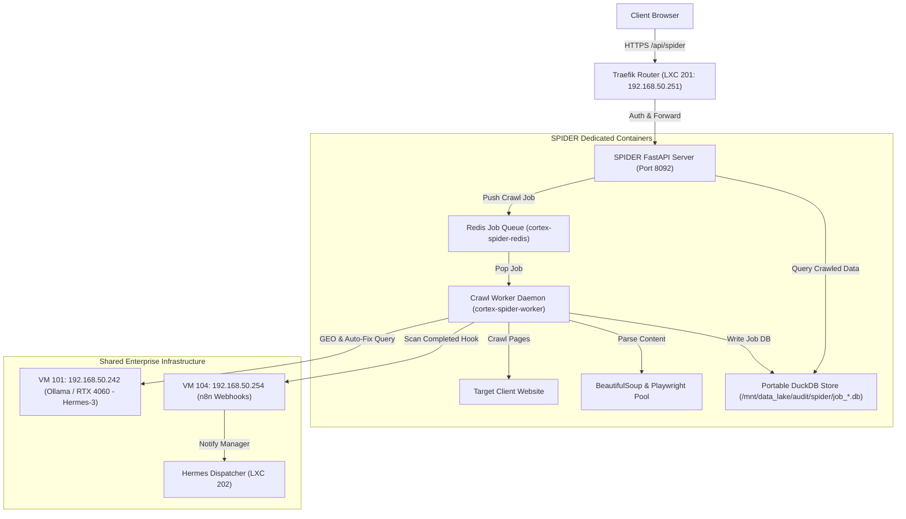

# SPIDER: ENTERPRISE SEO CRAWLER & AI-VISIBILITY SUITE
## Strategic Board Proposal for Platform Approval
**Prepared by:** FITS Engineering & SEO Development Teams  
**Target:** Board of Directors, Freelance IT Solutions (FITS)  
**Date:** June 5, 2026  

---

## EXECUTIVE SUMMARY

### The Opportunity
Search Engine Optimization (SEO) has undergone its most disruptive shift in 20 years. Search is no longer just about blue links on a Google page; it is about visibility in **AI Answer Engines**—such as Perplexity AI, ChatGPT Search, and Google’s Search Generative Experience (SGE). Traditional website crawlers like Screaming Frog are blind to this shift, and commercial suites like Semrush do not provide the specialized technical remediation tools developers need to act quickly.

### The Solution: SPIDER
**SPIDER** is a proprietary, standalone, high-performance SEO crawler and AI-visibility analysis suite built specifically for FITS. By combining high-speed headless web crawling with local GPU-accelerated LLM auditing (Ollama/Hermes-3) and developer auto-fix generation, SPIDER bridges the gap between technical auditing, semantic content copywriting, and AI search engine visibility.

### Business Impact
*   **70% Reduction in Technician Labor:** Automatically generates the exact code (JSON-LD schemas, Nginx redirects, robots rules) required to fix technical SEO errors, allowing technicians to copy-paste solutions rather than write them from scratch.
*   **High-Value Client Retention:** Generates premium, white-label client-ready PDF audit reports branded under the FITS identity to impress prospects and justify recurring retainer fees.
*   **Forefront Market Positioning:** Positions FITS as a leading agency capable of optimizing client sites for generative AI search visibility (Generative Engine Optimization - GEO).

---

## 1. STRATEGIC CONTEXT: THE SHIFT TO AI SEARCH (GEO)

To understand why SPIDER is critical, we must examine the architectural shift in how users find information online:

```
TRADITIONAL SEARCH (SEO)                    AI ANSWER ENGINES (GEO)
User Search Query                           User Natural Conversational Query
       │                                                   │
       ▼                                                   ▼
Google Page Rank & Indexing                 LLM Ingestion & RAG Synthesis
       │                                                   │
       ▼                                                   ▼
List of 10 Blue Web Links                   Single Synthesized Answer + Citations
(Goal: Drive Clicks to Site)               (Goal: Be the Cited Source for LLM)
```

### Why Traditional SEO is Insufficient
Traditional SEO ensures search engines can crawl, index, and evaluate a website’s keywords. However, AI Search Engines use **Retrieval-Augmented Generation (RAG)**. They crawl websites to ingest factual text, summarize it, and present a single response to the user, appending footnote citations. 

If a client's website is not structured in a way that AI models can easily parse, quote, and verify, **the site will never be cited**, leading to a complete loss of traffic in the AI-search era.

### Enter GEO (Generative Engine Optimization)
GEO is the practice of optimizing content specifically for Large Language Models (LLMs). SPIDER includes the industry's first **GEO Audit Engine**, scoring pages for:
1.  **AI Ingestibility:** Formatting compatibility with markdown-like text extractors.
2.  **Citation Likelihood:** The density of statistics, quotes, and primary facts that LLMs require to verify their answers.
3.  **Q&A Query Alignment:** The presence of direct answers to conversational search intents.

---

## 2. DECOUPLED & SCALABLE SYSTEM ARCHITECTURE

SPIDER is engineered as a fully isolated microservice stack running on the FITS command node (`192.168.50.252`), completely decoupled from the core Cortex and Viki daemons. This prevents high-volume crawl workloads from impacting RMM (Remote Monitoring & Management) dashboard responsiveness or DB transaction states.



### Architectural Pillars
1.  **Distributed Task Worker Queue:** Crawls are pushed to a private Redis broker. Background Python worker threads process the crawl queue asynchronously, preventing HTTP request timeouts for large-scale e-commerce sites.
2.  **Database-Per-Job Pattern (DuckDB):** Instead of writing to a single monolithic database, every crawl job creates a self-contained, high-performance DuckDB file (`/mnt/data_lake/audit/spider/job_{job_id}.db`). This eliminates write locks, ensures database speeds under concurrent crawls, and allows easy backup, migration, or removal of historical records.
3.  **Hybrid Scraper Engine:** Uses lightweight async HTTPX requests by default for rapid scraping, with automated fallback to a headless Chromium browser pool (Playwright) for JavaScript-heavy single-page applications.

---

## 3. COMPREHENSIVE FEATURE BREAKDOWN

SPIDER is divided into six core operational modules:

---

### MODULE 1: Technical SEO Crawler
*   **What it is:** A high-speed, directive-compliant web crawler that maps website topology.
*   **How it works:**
    *   Initiates from a seed URL, parses the HTML document, identifies internal and external hyperlinks, and pushes new internal paths to the crawl queue.
    *   Strictly parses and obeys `robots.txt` disallows and crawl-delay directives.
    *   Detects robots meta tags (`noindex`, `nofollow`) and canonical declarations on each page.
*   **Why it is there:** If a website has technical indexability errors, Google and AI engines cannot crawl it. This module maps the site's structure, finding orphan pages (pages not linked anywhere but present in the sitemap) and broken link endpoints (404/500 errors).

---

### MODULE 2: On-Page & Performance Diagnostics
*   **What it is:** HTML auditing engine evaluating on-page metadata, header hierarchies, and loading speeds.
*   **How it works:**
    *   Extracts and measures the length of Title tags and Meta descriptions (flagging empty, duplicate, or truncated tags).
    *   Inspects heading tag structures (`<h1>` through `<h6>`), alerting if `<h1>` is missing, duplicated, or out of nested order (e.g. `<h1>` followed by `<h3>` skipping `<h2>`).
    *   Calculates word counts, readability grades, and total image counts, identifying graphics missing descriptive `alt` tags.
    *   Measures time-to-first-byte (TTFB) and total server response latency.
*   **Why it is there:** On-page structure directly dictates search rankings. For example, duplicate H1 tags confuse crawler semantic indexing, thin content (<300 words) gets penalized as low quality, and heavy uncompressed images missing alt tags hurt both loading speeds and image search optimization.

---

### MODULE 3: AI-Powered Copywriting & Semantic Critique
*   **What it is:** A GPU-driven copy auditor evaluating the intent, clarity, and quality of content.
*   **How it works:**
    *   Extracts raw page text and passes a clean snippet to Ollama on VM 101 running the Hermes-3 model.
    *   The model analyzes the copy for readability, target audience intent matching, and conversion optimization.
    *   Outputs copywriting critiques, semantic keyword opportunities (identifying related terms the text should contain to establish topical authority), and optimized meta descriptions.
*   **Why it is there:** Traditional crawlers only count characters; they cannot read. By using AI to critique the actual content quality, FITS technicians get instant recommendations on how to rewrite thin or low-converting copy to capture high-value search intent.

---

### MODULE 4: GEO (Generative Engine Optimization) Audit Console
*   **What it is:** The industry's first dedicated dashboard evaluating how well a page ranks inside AI search engines.
*   **How it works:**
    *   The text copy is evaluated by the AI model against LLM parsing standards.
    *   **AI Ingestibility Score (1-100):** Rates how cleanly text can be extracted and summarized by LLM scrapers.
    *   **Citation Likelihood (1-100):** Rates the presence of data, statistics, and citations that LLMs require to reference a source.
    *   **Conversational Q&A Score (1-100):** Measures how well the page answers user queries framed as questions.
    *   Generates a list of **GEO Recommendations** (e.g. "Add a citable quote from an industry expert" or "Restructure the second paragraph into a Q&A format").
*   **Why it is there:** This future-proofs client websites. As search behavior transitions to conversational AI, having high GEO scores guarantees that our clients are recommended as authoritative references by ChatGPT, Perplexity, and Gemini SGE.

---

### MODULE 5: Developer Auto-Remediation Fix Engine
*   **What it is:** An automated code-generation panel that provides the exact code needed to fix the discovered SEO issues.
*   **How it works:**
    *   If a canonical or redirect chain is found, the engine outputs the exact **Nginx 301 redirect rule** command.
    *   Analyzes page entities and generates a complete, valid **JSON-LD Schema script** (e.g. LocalBusiness, FAQPage, Article) ready to be pasted into the page head.
    *   Provides optimized robots directives and a rewritten H1 tag.
*   **Why it is there:** Most audit tools only tell you what is wrong, leaving the technician to research and write the fix. By auto-generating the code (e.g. valid structured schema or server redirects), SPIDER reduces the developer's time-to-remediate from hours to seconds.

---

### MODULE 6: Live Google SERP Simulator
*   **What it is:** An interactive preview card simulating desktop and mobile Google Search Results Pages (SERPs).
*   **How it works:**
    *   Renders the page snippet exactly as it will appear in Google search results using Google dark theme styles.
    *   Provides live input fields for the Title and Meta Description.
    *   Tracks character counts in real time, warning if the length limits (60 chars for title, 160 chars for description) are breached, simulating Google's snippet truncation.
    *   Allows loading the FITS AI suggestions with one click, and copy-exporting the finalized HTML tags.
*   **Why it is there:** Prevents technicians from publishing truncated titles and descriptions. The live preview lets copywriters align text boundaries visually before deploying changes.

---

## 4. REPORTING ENGINE & CLIENT PDF COMPILER

To WOW clients and prospects, SPIDER includes a high-fidelity reporting engine:

```
┌────────────────────────────────────────────────────────┐
│               PLAYWRIGHT PDF COMPILER                  │
├────────────────────────────────────────────────────────┤
│ 1. Extract DuckDB Job Data (Averages & Page Audits)    │
│                           │                            │
│                           ▼                            │
│ 2. Load FITS HTML Print Template (CSS Grids/Web Fonts) │
│                           │                            │
│                           ▼                            │
│ 3. Open Headless Playwright Chromium Page              │
│                           │                            │
│                           ▼                            │
│ 4. Execute page.pdf() -> Output Binary Stream          │
└────────────────────────────────────────────────────────┘
```

### The PDF Compilation Advantage
Instead of converting DOCX files using LibreOffice (which often clips tables, breaks headers, and messes up fonts), SPIDER loads a beautifully designed HTML print template directly into a headless Playwright Chromium instance and prints it to PDF. 
This guarantees:
*   **Pixel-Perfect Layouts:** Perfect support for flexbox grids, circular SVG indicators, and custom Google Fonts (Inter, Orbitron).
*   **Professional Branding:** Premium dark cover pages, two-color FITS branding logos, structured headers, and clean page-break flows.
*   **Actionable Content:** Includes summaries of technical scores, critical errors lists (errors counts, missing titles, alt tag gaps), and page-level AI content suggestions.

### Standard Exports
For developers who need raw data, SPIDER provides one-click downloads of:
*   **Structured CSV Sheets:** Listing all URLs, HTTP status codes, load speeds, word counts, and scores.
*   **Excel Ready Exports:** Detailed links relationships and image alt grids.

---

## 5. ENTERPRISE GATEWAY & SSO INTEGRATION

SPIDER is fully integrated with the FITS enterprise security gateway:
*   **Authelia Single Sign-On (SSO):** All routes (`/api/spider/*`) are protected by Traefik Ingress Authelia middlewares. Technicians and administrators must authenticate through the centralized LLDAP portal before accessing crawl tools or databases.
*   **Secure API Stripping:** Traefik dynamically strips the path prefix `/api/spider` and forwards authenticated traffic internally to SPIDER's docker stack on port `8092`.
*   **Local Data Isolation:** DuckDB files are stored in the shared Forensic Data Lake (`/mnt/data_lake/audit/spider/`) which is backed up via stateful VM BTRFS logs, ensuring audit data is never exposed or lost.

---

## 6. BUSINESS CASE & ROI ANALYSIS FOR FITS

Implementing SPIDER yields direct financial and operational benefits:

### A. Sales & Lead Generation Tool (WINS CLIENTS)
*   **Action:** FITS sales representatives run a quick 50-page crawl on a prospect’s website during a pitch, compile the FITS-branded PDF report, and present it on the spot.
*   **Impact:** The prospect is presented with a highly detailed, professional audit showing their AI-search visibility gaps and copywriting critiques. This establishes immediate authority, significantly increasing sales conversion rates.

### B. Service Delivery Automation (SAVES TIME)
*   **Action:** Field technicians use SPIDER to audit new client sites. The engine auto-generates JSON-LD local business schemas and Nginx redirection blocks.
*   **Impact:** Reduces the technician hours required for search engine compliance setup. A task that typically takes 3-4 hours of manual writing and testing is reduced to a 5-minute copy-paste operation.

### C. Retainer Value Justification (KEEPS CLIENTS)
*   **Action:** FITS runs a monthly SPIDER crawl on all active SEO clients and exports the progress reports.
*   **Impact:** The client receives a clean monthly PDF report showing their SEO score improvements (e.g. "SEO score increased from 64% to 88%"). This tangible deliverable justifies retainer fees and reduces client churn.

---

## 7. TIMELINE & CURRENT PROJECT STATUS

| Phase | Milestone | Deliverables | Status |
| :--- | :--- | :--- | :--- |
| **Phase 1** | Docker Stack Setup | Dockerfile, Compose stack, Redis broker, Ingress Routing. | **COMPLETE** |
| **Phase 2** | Core Backend & Crawler | Async crawler logic, DuckDB schemas, worker task loop. | **COMPLETE** |
| **Phase 3** | AI & GEO Auditing | Ollama VM 101 integration, GEO metrics scoring. | **COMPLETE** |
| **Phase 4** | Auto-Fix & SERP Sim | Nginx/robots generators, Live SERP simulator panel. | **COMPLETE** |
| **Phase 5** | PDF Compilation | Playwright A4 PDF printer, FITS HTML print template. | **COMPLETE** |
| **Phase 6** | Gateway Integration | Dashboard gateway button, Traefik routes reload. | **COMPLETE** |

### Next Steps (Post-Approval)
With the core SPIDER system fully built and tested online, we await board approval to:
1.  Train FITS copywriting and developer technicians on using the Page Inspector and SERP Simulator workspaces.
2.  Enable the n8n webhook listener for automated task tracking.
3.  Deploy the sales team outreach workflow utilizing the PDF generator.

---

## CONCLUSION & RECOMMENDATION

SPIDER represents a major technological asset for Freelance IT Solutions. By automating search diagnostics, generating code-level fixes, and addressing the future of AI-search visibility (GEO), SPIDER elevates FITS' service capability to the forefront of the industry. 

**We recommend the formal approval and launch of the SPIDER platform.**
