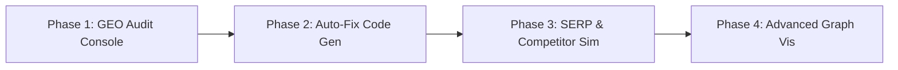

# SPIDER: Product Roadmap to the Forefront of SEO
## Surpassing Screaming Frog, SurferSEO, & Semrush

This roadmap outlines the advanced capabilities we can build into **SPIDER** to elevate it from a standard technical site auditor to a state-of-the-art enterprise SEO intelligence suite.

---

## 1. Core Differentiators & Innovative Modules

### A. Generative Engine Optimization (GEO) Audit (surpassing SurferSEO AI)
Traditional SEO focuses on Google's search algorithms. Modern search is shifting to AI Answer Engines (Perplexity AI, OpenAI Search, Gemini SGE). SPIDER will be the first tool to offer a native **GEO Audit Console**:

*   **AI Ingestibility Rating:** Analyzes how easily an LLM can parse and summarize your content (checking semantic structure, clear headings, and logical reading flows).
*   **Citation & Synthesis Score:** Evaluates the page for "citable elements" (expert quotes, primary statistics, unique data tables). AI search engines prioritize pages with high authority signals for citation footnotes.
*   **Q&A Conversational Mapping:** Audits if the copy answers natural-language questions (who, what, how, why) directly.
*   **GEO Recommendations Engine:** Ollama generates structural content rewrites (e.g., adding a quick-facts table or summary block) specifically to trigger AI engine citation.

### B. Automated Fix Engine (surpassing SearchAtlas OTTO SEO)
Instead of just listing problems, SPIDER will generate the exact technical code necessary to remediate them:

*   **Instant Redirection Rules:** If SPIDER finds 302 redirects or 3-hop redirect chains, it will output the exact server rewrite rules (Nginx server blocks, Apache `.htaccess` directives, or Cloudflare worker JS) to fix them.
*   **Schema.org Auto-Constructor:** Generates perfectly validated JSON-LD schema blocks based on scraped page content (e.g., auto-filling Author, Article, Organization, or Product schema).
*   **Custom robots.txt Generator:** Generates a tailored `robots.txt` disallowing crawl paths that returned high error rates or duplicate content scores.
*   **Dynamic sitemap.xml Exporter:** Generates a perfectly structured, clean `sitemap.xml` containing only 200 OK indexable pages.

### C. Live SERP & Snippet CTR Simulator
*   **Google SERP Snippet Preview:** Renders an exact replica of how the title, URL structure, and meta description will display on both Google Desktop and Google Mobile.
*   **Interactive Snippet Editor:** Allows the user to edit the title/description in real-time, displaying a character and pixel-width count, and highlighting in red when Google's search result snippet boundary is breached.
*   **AI Rewrite Overlay:** A one-click button invoking Ollama to instantly rewrite the snippet for maximum click-through rate (CTR) based on emotional triggers or curiosity hooks.

### D. Competitor Gap Analyzer
*   **Competitor URL Comparison:** Allows the user to input up to 3 competitor URLs alongside their page.
*   **Semantic Contrast Matrix:** Compares heading count, word density, readability grade, and schema implementation side-by-side.
*   **AI Keyword Gap Suggestions:** Ollama analyzes the competitor text, identifies terms they cover that the user page lacks, and suggests content additions to establish topical authority.

---

## 2. Advanced Technical Scraper Capabilities (surpassing Screaming Frog)
*   **Broken Link / Redirect Chain Graph:** An interactive link-mapping node diagram showing the exact path of redirect hops and identifying the source page causing broken links.
*   **Internal Link Distribution:** Analyzes page-level internal link counts, flagging orphan pages (pages with 0 internal links) and identifying page-rank flow gaps.
*   **Core Web Vitals Telemetry:** Runs standard page loading timings but also records Largest Contentful Paint (LCP) and Cumulative Layout Shift (CLS) through Playwright's browser API.

---

## 3. Visual UI Mockup Concepts
To match this advanced functionality, we will enrich the SPIDER dashboard UI:
*   **GEO Audit Tab:** Displays an AI visibility radar chart and side-by-side content critique compared to LLM ingestion benchmarks.
*   **Developer Fix Tab:** Side-by-side panel showing the error on the left and the ready-to-copy code (JSON-LD, Nginx rewrites, XML sitemap) on the right.
*   **Snippet Simulator Modal:** A pop-up workspace for real-time meta tag optimization.

---

## 4. Phase-by-Phase Development Plan

### Let me know which features you want to focus on first! We can implement the GEO Audit Console (Phase 1) and the Developer Auto-Fix Engine (Phase 2) right away inside our modular python stack.
