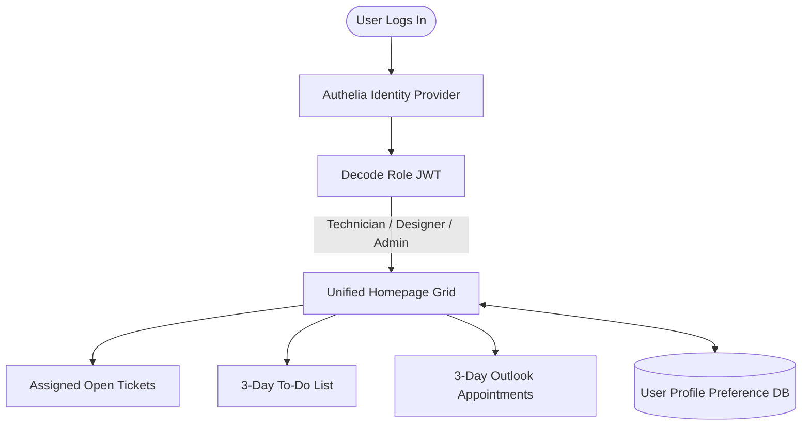

# CORTEX: IDENTITY & MULTI-USER ROLE-BASED DASHBOARDS
## [VERSION 1.5] - SPECIFICATION

CORTEX employs a multi-tenant portal with dynamically populated dashboards. All user groups share a unified dashboard grid engine, but retrieve personalized, context-filtered operational telemetry.

### Architectural Design
*   **Authentication & Directory Mapping:**
    *   **Authelia** maps users to organizational groups in **LLDAP** (e.g., `Cortex-Admins`, `Cortex-Designers`, `Cortex-Technicians`).
    *   Signed JSON Web Tokens (JWT) capture identity, role, and department scope.
*   **Core Unified Widgets:**
    *   **Assigned Open Tickets Widget:** Displays the logged-in user's active, unresolved helpdesk tickets from the GLPI database.
    *   **3-Day To-Do List Widget:** Interactive task tracker due within 72 hours, synced with GLPI action plans.
    *   **3-Day Outlook Appointments Widget:** Calendar events scheduled for the next 3 days from Microsoft 365 Graph API.
*   **Aesthetics & State Persistence:**
    *   Responsive glassmorphic CSS Grid.
    *   Drag-and-drop layout persisted in database under `user_dashboard_preferences`.
