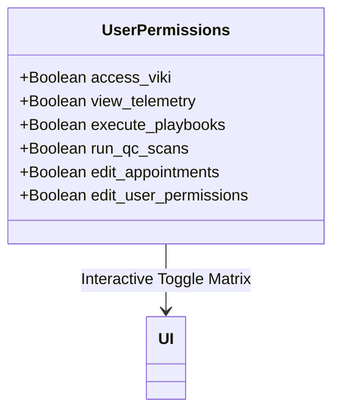

# CORTEX: GRANULAR PERMISSIONS & VIKI ASSIGNMENT PANEL
## [VERSION 1.5] - SPECIFICATION

CORTEX implements a visual, glassmorphic **Security & Access Console** accessible strictly to users with Administrative privileges (`Cortex-Admins`). This page features an interactive matrix to toggle explicit permissions per user or department.

### Functional Design
*   **Interactive Toggles (Tick / Untick):**
    *   Toggles trigger background POST requests to the API, updating database settings and updating frontend layout state.
    *   *Permission Categories:* Telemetry HUD, ticket resolution, CRM access, script execution, access matrix controls.
*   **VIKI AI Assignment (Assign / Unassign):**
    *   **If Assigned:** The user gets access to the floating 3D holographic head matrix, active voice synthesis (TTS), local audio transcriber fallback (`/api/transcribe`), and the fullscreen chat workspace.
    *   **If Unassigned:** All VIKI-related visual elements, assets, STT hooks, and chat sidebars are completely stripped from their view to preserve resources and protect data.
