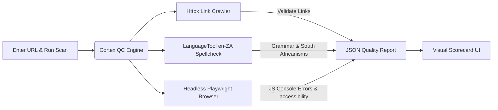

# CORTEX: AUTOMATED WEB QUALITY CONTROL (QC) SCANNER
## [VERSION 1.5] - SPECIFICATION

A dedicated QC Scanner lives inside the developer/designer tools panel, allowing teams to manually initiate pre-live checks on staging or production URLs.

### Technical Blueprint
*   **On-Demand Execution:** Interactive input console widget. UI displays live progress status during crawler execution.
*   **Broken Link Detection:** Asynchronous Python-based link checker processing the target page's DOM.
*   **South African English (en-ZA) Integration:** Pre-configured LanguageTool container utilizing regional dictionaries (e.g. *programme*, *minimise*).
*   **Performance, SEO, & Accessibility Checks:** Lighthouse CLI audit headlessly via chromium returning visual scorecards (Performance, Accessibility, SEO, Best Practices) directly in the UI.
