# CORTEX: MS 365 / OUTLOOK CALENDAR INTEGRATION
## [VERSION 1.5] - SPECIFICATION

Microsoft 365 functions as the Single Source of Truth (SSoT) for all scheduling and calendars. CORTEX implements bidirectional synchronization to prevent scheduling conflicts.

```mermaid
sequenceDiagram
    participant CRM as GoHighLevel CRM
    participant Cortex as Cortex Middleware
    participant Graph as MS 365 Graph API
    
    rect rgb(30, 40, 50)
    Note over CRM, Graph: Dynamic Conflict Avoidance
    CRM->>Cortex: Trigger: Request Appointment Slot
    Cortex->>Graph: Query calendarView (Next 3 Days)
    Graph-->>Cortex: Return Busy/Free Windows
    alt Slot is Available
        Cortex->>Graph: Create Outlook Calendar Event (POST /events)
        Graph-->>Cortex: Confirm Created
        Cortex->>CRM: Commit CRM Appointment
    else Slot Clashes
        Cortex->>CRM: Terminate CRM Booking (Return Clash Warning)
    end
    end
```

### Technical Blueprint
*   **Microsoft Graph API Connection:** Azure AD App registration using secure OAuth 2.0 client credential flows.
*   **Double-Booking Mitigation Engine:** Check against target MS 365 calendar using `calendarView` for the targeted date/time window. Clash rejects booking.
*   **Dynamic Dashboard Synced View:** Real-time 3-Day Appointments Widget rendering meetings, private blocks, and client sessions.
