# CORTEX: INTEGRATED OVERTIME & TIME-TRACKING SYSTEM
## [VERSION 1.5] - SPECIFICATION

CORTEX natively absorbs overtime tracking directly into its existing stack, replacing legacy microservices like the standalone `.NET Core` app.

```mermaid
sequenceDiagram
    participant User as Staff Member
    participant UI as CORTEX React Widget
    participant Fast as FastAPI Backend
    participant GLPI as GLPI Ticketing Engine
    participant Adm as Admin Approval Console
    
    rect rgb(35, 45, 55)
    User->>UI: Selects Active Ticket & Enters Overtime Hours
    UI->>Fast: POST /api/overtime/log (Hours + Deliverable)
    Fast->>GLPI: Add ITILFollowup Comment [PENDING APPROVAL]
    Fast->>Adm: Populate Admin Approval Queue
    
    Adm->>Fast: Action: Approve Overtime Request
    Fast->>GLPI: Add ITILFollowup Comment [APPROVED]
    Fast->>Fast: Commit to Permanent Ledger
    end
```

### Technical Design
*   **Unified Tech Stack Absorption:** Port C# .NET logic to **CORTEX FastAPI core** and Next.js frontend into the **React dashboard** on MariaDB. This reduces container sprawl on `CORTEX-Core`.
*   **Staff Logging Flow:** Overtime widget detects the logged-in user's assigned active tickets from GLPI, accepts hours claimed and a summary, writes a stateful record (`Status: Pending`), and appends a pending `ITILFollowup` ticket comment in GLPI.
*   **Manager Approval Interface:** Admins approve/reject entries in a scrollable queue. Action updates local ledger and posts a final public follow-up comment directly to the original GLPI ticket (e.g. `[OVERTIME APPROVED] 2.5 hours verified by Admin`).
