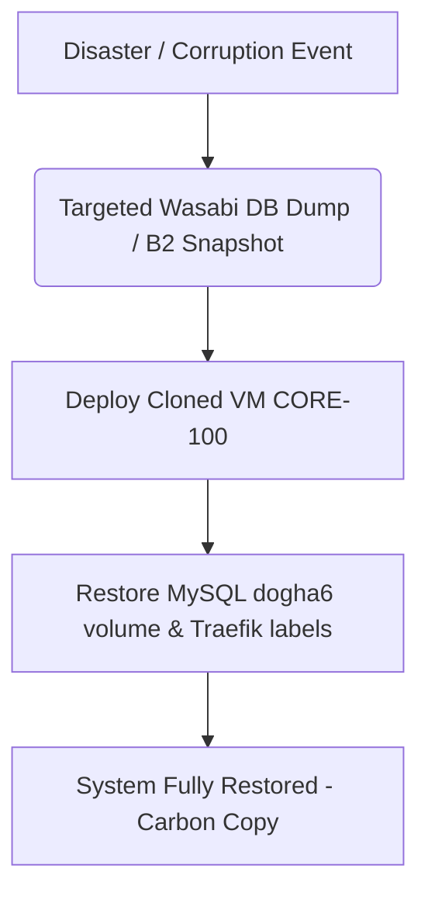

# CORTEX: SECURITY AUDITING, DATA RECOVERY, & INTEGRITY PROTOCOLS
## [VERSION 1.5] - SPECIFICATION

Operational protocols addressing core security, disaster recovery, and diagnostic testing questions.

### A. RMM Disaster Recovery & Carbon-Copy Restoration
*   **Backup Stack:** Backups utilize **Bareos** (offsite S3-compatible Wasabi storage) and **Restic** (targeting Backblaze B2) to secure database `dogha6` in the MySQL container.
*   **BTRFS Snapshots:** VM LAKE-102 runs read-only BTRFS snapshots of Forensic Data Lake filesystems.
*   **Restoration:** Importing Restic DB dump and linking persistent Docker volumes into a freshly cloned server template recovers the RMM ecosystem with zero agent re-registration.

### B. Global API Kill Switch
*   **Concept:** A central isolation valve to stop third-party API connection data exfiltration during threat states.
*   **Implementation:** Admin Console button activates a Redis flag `api_kill_switch_active: true`. Backend middleware interceptor blocks outbound requests to SaaS endpoints (503 Service Unavailable).
*   **Autonomous Triggering:** Reflex Daemon triggers this kill switch if active host-level lateral threat indicators (Mimikatz) are captured by Vector/Velociraptor sensors.

### C. White-Box & Black-Box Diagnostic Integrity Testing
*   **White-Box Testing (Static Code & SQL Audits):** Enforce strict typing annotations in Python services and TypeScript, and verify that VIKI's ReAct SQL discovery self-corrects using structured database introspection.
*   **Black-Box Testing (Threat & Routing Ingress Verification):** Run simulated breaches to verify automated Reflex playbooks, and audit external proxy load-balancing routing configs.
