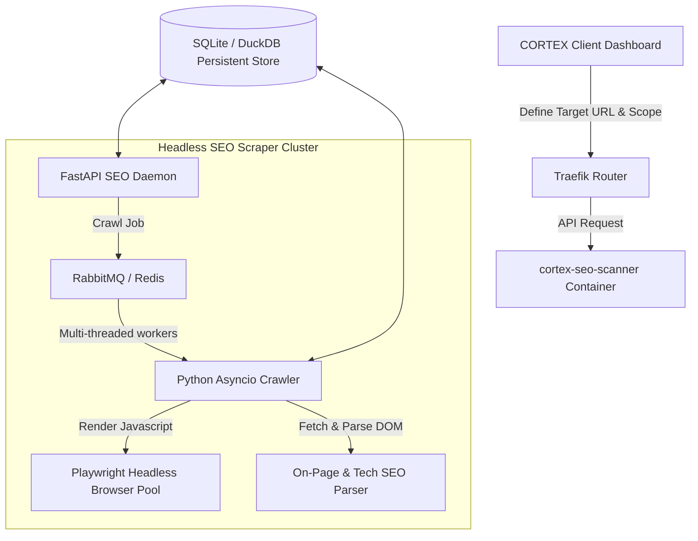

# CORTEX: IN-DEPTH SEO DIAGNOSTIC SCANNER
## [ARCHITECTURAL BLUEPRINT & TECHNICAL SPECIFICATION]

This document outlines the architectural blueprint for the specialized **CORTEX In-Depth SEO Diagnostic Scanner**. The scanner is engineered to target the diagnostic depth of industry-standard tools like **Screaming Frog SEO Spider** and **SearchAtlas**, running inside a standalone, dedicated Docker container (`cortex-seo-scanner`) to isolate crawl workloads.

---

## 1. DOCKERIZED ARCHITECTURE & SCALING SPECIFICATION

Because high-volume crawling of large-scale staging or client websites is resource-intensive, the SEO scanner utilizes an asynchronous, headless architecture.

*   **Technology Stack:** Python (Asyncio & Httpx), Playwright (Chromium headless pool), DuckDB (fast in-memory/on-disk tabular data analysis), and Beautiful Soup 4 / lxml.
*   **Javascript Rendering:** Dynamic single-page applications (SPAs) are audited by rendering pages headlessly, enabling the analyzer to inspect the DOM *after* client-side execution.

---

## 2. HIGH-FIDELITY SEO SCANNING CAPABILITIES

The scanner evaluates four critical pillars of SEO health, aligning with professional auditor standards:

### A. Deep SEO Crawling & Path Discovery
*   **Custom User-Agent Spoofing:** Configurable crawler identity (e.g., *Googlebot-Desktop, Googlebot-Mobile, Screaming Frog Spider, custom CortexBot*).
*   **Robots & Directive Compliance:** Parses and strictly obeys `robots.txt` disallow paths, `noindex`/`nofollow` meta tags, and canonical directives.
*   **Anchor Mapping:** Discovers and maps internal and external link structures, tracking link depth (number of clicks from the homepage).
*   **Orphaned Page Discovery:** Cross-references crawled pages against the site's XML sitemap to discover unlinked, orphaned pages that search engines cannot find.

### B. On-Page SEO Diagnostics (SearchAtlas & Screaming Frog Standards)
*   **Title & Metadata Auditing:**
    *   Flags missing, duplicate, or multiple title tags.
    *   Evaluates character length (warning if titles are under 30 or over 60 characters, or meta descriptions are outside 110–160 characters).
    *   Tracks pixel width (simulating Google's SERP truncation limit).
*   **Heading Structure Inspection:**
    *   Audits `<h1>` through `<h6>` tags.
    *   Flags missing `<h1>` tags, multiple `<h1>` tags on a single page, and improper nesting (e.g., `<h1>` followed by `<h3>` skipping `<h2>`).
*   **Content & Keyword Quality Analysis:**
    *   Computes word counts per page to identify "thin content" (pages under 300 words).
    *   Identifies internal duplicate content by calculating cosine similarity between page bodies.
    *   Flags keyword stuffing patterns and calculates readability scores (Flesch-Kincaid).
*   **Image SEO Auditing:**
    *   Identifies images missing descriptive `alt` text.
    *   Flags heavy images (>100KB) and unoptimized formats (suggesting WebP/AVIF conversions).

### C. Technical SEO & Indexability Analyzer
*   **Canonicalization Validation:** Detects missing canonical tags, canonical tags pointing to 404 pages, or canonical loops.
*   **Structured Data / Schema.org Extractor:**
    *   Extracts and parses all JSON-LD, Microdata, and RDFa schema structures.
    *   Validates syntax against official Schema.org standards (flagging missing required properties for Article, LocalBusiness, FAQ, Product, and Breadcrumbs).
*   **Redirect & Protocol Audit:**
    *   Traces complete HTTP redirect chains (e.g., `http://example.com` -> `https://example.com` -> `https://www.example.com/home`), flagging unnecessary hops.
    *   Flags temporary redirect codes (302, 307) used where permanent redirects (301) are appropriate.
    *   Mixed Content Warnings: Identifies insecure HTTP resources requested inside secure HTTPS pages.

### D. Performance & Core Web Vitals Audit
*   **Response Speed (TTFB):** Measures Time to First Byte for every request.
*   **Render-Blocking Resources:** Flags CSS, JavaScript, and font imports that obstruct initial page rendering.
*   **Core Web Vitals Estimation:** Measures Largest Contentful Paint (LCP) and Cumulative Layout Shift (CLS) via headless browser telemetry.

---

## 3. FIX RECOMMENDATION & OPTIMIZATION AUTO-GENERATION

The true value of the scanner lies in generating actionable, high-quality fixes directly for the design and copy team:

*   **Meta Tag Optimizer:** Recommends exact rewrite suggestions if a title or meta description is flagged as low-quality or truncated.
*   **JSON-LD Schema Builder:** Auto-generates clean, compliant JSON-LD structured data snippets based on missing elements found on local business or article pages.
*   **Sitemap Auto-Generator:** Compiles a perfectly formatted, updated `sitemap.xml` file ready for submission to Google Search Console.
*   **Redirection Fix Scripts:** Generates server-level redirect instructions (e.g., Nginx rewrite blocks or Apache `.htaccess` rules) to resolve complex redirect chains.

---

## 4. UNIFIED INTERACTIVE SEO REPORTING HUD

The reporting workspace is designed as a deep tabular interface, separate from basic site stats:

*   **Screaming Frog Style Data Grid:** Features filterable tabs for *All, Internal, External, HTML, Images, CSS, JS, Redirects (3xx), Client Errors (4xx), Server Errors (5xx)*.
*   **Visual Crawl Tree Map:** Interactive node graph visualizing internal linking structures, highlighting isolated or high-depth pages.
*   **Exportable Packages:** Instant download of crawling datasets in CSV, Excel, or comprehensive diagnostic PDF reports to present directly to clients.
