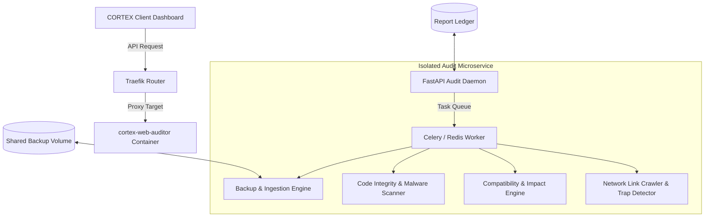

# CORTEX: COMPREHENSIVE WEBSITE HEALTH & SECURITY AUDITOR
## [ARCHITECTURAL BLUEPRINT & TECHNICAL SPECIFICATION]

This document outlines the architectural blueprint for the specialized **CORTEX Comprehensive Website Health & Security Auditor**. Designed as an isolated, high-performance auditing suite running in its own dedicated Docker container (`cortex-web-auditor`), this system provides web designers and developers with a complete, forensic-grade bill of health for any client website.

---

## 1. DOCKERIZED ARCHITECTURE & SYSTEM DEPLOYMENT

To prevent performance degradation on the primary CORTEX controller, the auditor runs as a containerized microservice. It is configured to run asynchronously, persisting reports and backups in a shared volumes partition.

*   **Technology Stack:** FastAPI (Python), Celery, Redis (Broker), ClamAV daemon, PHP-Parser, and Playwright.
*   **Isolation Guarantee:** Hard resource limits are enforced in Docker Compose to ensure background crawlers and deep-scans cannot starve other daemons of CPU or memory.

---

## 2. CORE FUNCTIONAL ENGINES & AUDITING MATRIX

### A. Site Ingestion & Backup Engine
Before executing any diagnostics, the auditor creates an exact point-in-time snapshot of the target site to guarantee data integrity and support offline white-box analysis.
1.  **Credentials Ingestion:** Securely accepts user-provided credentials (SFTP/SSH, FTP, Database, or WordPress Admin Credentials) via encrypted HTTPS request payload.
2.  **Filesystem Archiving:** Downloads and packages the complete public directory (e.g., `public_html`) into a compressed tarball (`site_backup_[timestamp].tar.gz`) stored in the shared volume.
3.  **Database Snapshotting:** Connects to the remote database using provided details to run `mysqldump` / `pg_dump`, compiling a structured schema and dataset export.

### B. File Integrity & Code Quality Scanner
Once the files are pulled locally into the container's isolated workspace, a deep static analysis is executed:
*   **Clean Code Verification:**
    *   Runs automated checks (PHP CodeSniffer / ESLint) evaluating files against industry standards (e.g., PSR-12, Airbnb Style Guide).
    *   Identifies dead variables, empty catch blocks, unchecked user inputs, and high cyclomatic complexity.
*   **File Corruption Audit:**
    *   Downloads vanilla checksums for known core platforms (WordPress, Joomla, Drupal) and compares them against the local snapshot to pinpoint altered or corrupted core files.
*   **Malicious Code Scan:**
    *   Scans all target files utilizing a localized **ClamAV** engine alongside custom **YARA rules** optimized for web shells, base64 obfuscated payloads, injection scripts, and common backdoors.
*   **Conflict Detector:**
    *   Cross-references active frameworks, hooks, and active libraries to highlight conflicting event listeners, duplicate library imports (e.g., multiple jQuery versions loaded), or duplicate plugin hooks.

### C. PHP Configuration Auditor
For PHP-driven applications, configuration weaknesses are a primary attack vector. The auditor reads runtime settings and target configs to flag security discrepancies:
*   **Disabled Functions Check:** Verifies that dangerous system execution tools (`exec`, `system`, `passthru`, `shell_exec`, `proc_open`, `popen`) are explicitly disabled in `php.ini` under `disable_functions`.
*   **Insecure Directives Inspection:** Flags insecure setups including `allow_url_fopen = On`, `allow_url_include = On`, `expose_php = On`, and `display_errors = On` (in production).
*   **Resource & Timeouts Audit:** Assesses memory limits, execution times, upload limits, and post-size thresholds relative to typical application standards.
*   **HTTP Security Headers Validation:** Crawls public endpoints to ensure modern browser security flags (`Strict-Transport-Security`, `Content-Security-Policy`, `X-Frame-Options`, `X-Content-Type-Options`, `Referrer-Policy`) are correctly served.

### D. Version Compatibility & Impact Assessment
*   **Plugin & Library Inventory:** Extracts version metadata from all detected dependencies (Composer lockfiles, npm package.json, WordPress plugin headers).
*   **SQL & PHP Engine Compliance:** Queries active host server runtimes to verify current execution engines.
*   **Compatibility Mapping:** Evaluates active codebases against target PHP upgrades (e.g., checking if legacy libraries will fail on PHP 8.2+ due to syntax deprecations or class changes).
*   **Impact Analysis & Upgrades:**
    *   Outputs a detailed roadmap of recommended upgrades (e.g., *Upgrade WooCommerce to v8.9.0*).
    *   Outlines concrete impacts: anticipated downtime, known breaking changes, plugin version conflicts, and potential code syntax fixes required.

### E. Dead Links & "Black Hole" Trap Detector
An asynchronous crawler parses the ingested HTML output of all crawled pages:
*   **Link Verification:** Validates every internal and external anchor, returning detailed logs of 404, 301, 302, and 500 error routes.
*   **Black Hole / Crawler Trap Mitigation:**
    *   Flags infinite redirect chains.
    *   Identifies dynamic calendars, uncapped query parameters, or recursive relative link URLs that trap search engine spiders in infinite loops.

---

## 3. DESIGNER BILL OF HEALTH & SECURE EXPORT

The output is presented as an interactive, highly visual **Designer Security & Quality Dashboard** separate from basic CORTEX toolings:

*   **Risk Metrics Scorecard:** Yields a high-level letter grade (A through F) across five domains: *Code Quality, Core Integrity, System Security, Stack Compatibility, and Link Integrity*.
*   **Downloadable Forensic Bundle:** Generates a structured audit report in HTML, JSON, or a formatted PDF.
*   **Actionable Remediation Guide:** Lists specific line numbers, file paths, and exact configurations requiring immediate adjustment, ensuring the developer can systematically check off fixes until they achieve a clean bill of health.
